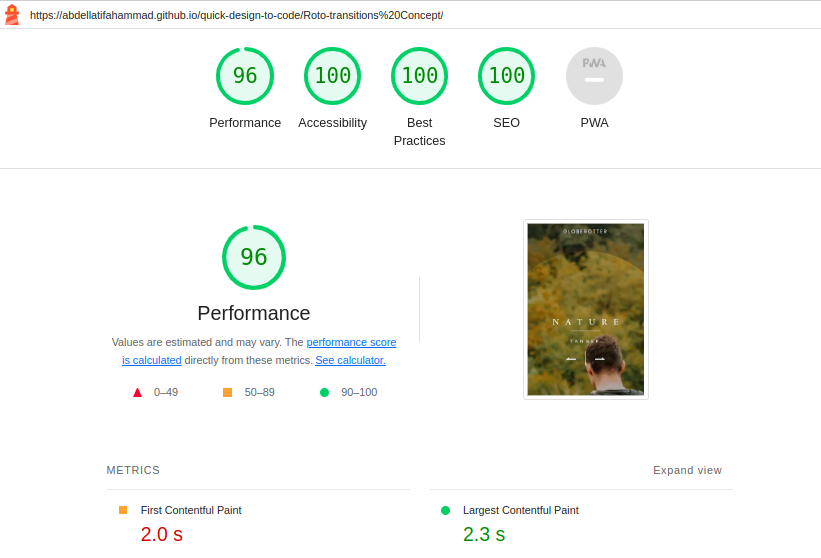

# Quick Design to Code - Roto-transitions Concept

This project is part of the 'Quick Design to Code' series, where I transform popular designs found on platforms like Dribbble into web pages using HTML, CSS, and JavaScript, striving for high-quality implementation.

## Lighthouse Report

## ✨ Design Animation Inspiration 

The inspiration for this project comes from the Dribbble shot titled "[Roto-transitions Concept](https://dribbble.com/shots/8867020--Roto-transitions-Concept)." The primary objective was to bring the design to life by recreating its intricate animations and smooth transitions, If you are already a front-end developer, I highly suggest trying to recreate it because it is fun 😁, and don't forget it to give it a start ⭐.

## Acknowledgments

Original design concept by [Giulio Cuscito](https://dribbble.com/Giulio_Cuscito).

## License

This project is open-source and available under the MIT License.

---
Created with 💓 By me (Abdellatif Ahammad).